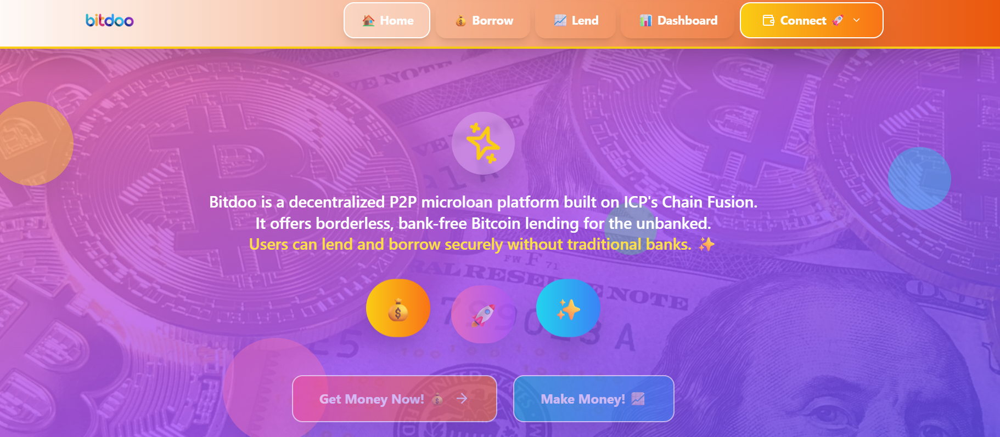
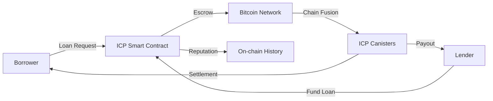
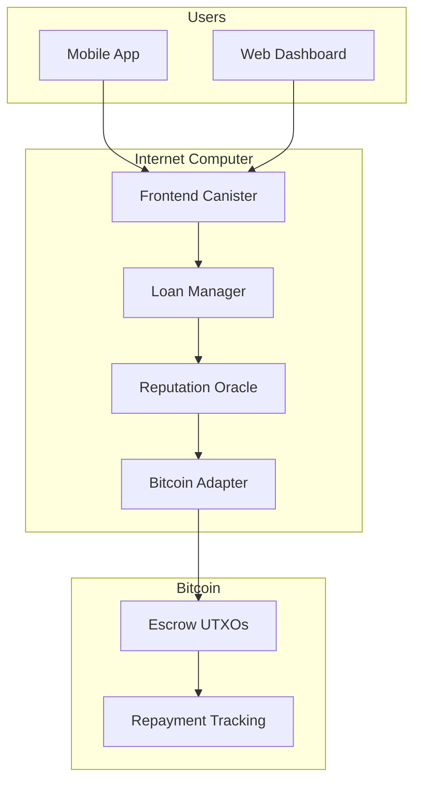

# 🌍 Bitdoo - Decentralized Bitcoin Microloans for the Unbanked powered by ICP's Chain Fusion technology

## 📌 Mission Statement
Democratize credit access by enabling programmable Bitcoin loans through Internet Computer smart contracts - eliminating predatory middlemen in microfinance.

## 🌐 The Global Unbanked Crisis
**1.4 billion people** lack access to basic financial services due to:
- 🏦 Geographic exclusion (rural communities)
- 📉 Exploitative rates (30-200% APR)
- 🕵️♂️ Opacity in traditional microfinance

## ⚡ How Bitdoo Works

### For Borrowers
1. **Request**: Set loan terms (amount/purpose/duration)
2. **Get Funded**: Global lenders compete to fund
3. **Repay**: Automated BTC repayments build on-chain credit

### For Lenders
1. **Browse**: Filter by risk score/category/location
2. **Fund**: Non-custodial ICP escrow
3. **Earn**: Yield from repayments + interest (1-10% APR)

## 🚀 Why Bitdoo is Sustainable

| Factor | Our Advantage |
|--------|---------------|
| **Economic Model** | 1% protocol fee sustains development |
| **Tech Foundation** | ICP's reverse gas model eliminates user fees |
| **Market Fit** | 300% cheaper than avg microfinance rates |
| **Scalability** | Chain Fusion enables native BTC transactions |
| **Regulatory** | Non-custodial design reduces compliance burden |

## 🛠️ Technical Architecture

**Key Components:**
1. **Motoko Smart Contracts**: Loan lifecycle management
2. **Chain Fusion**: Native Bitcoin transaction processing
3. **Reputation System**: On-chain credit scoring
4. **Radix UI**: Accessible frontend components

## 🔥 Unique Value Proposition

**For Borrowers:**
- 5-minute approvals vs weeks in traditional finance
- 70% lower interest than local loan sharks
- Build credit history via on-chain repayments

**For Lenders:**
- Earn yield on Bitcoin holdings
- Transparent risk assessment
- Default protection via smart contract triggers

## 🛡️ Security Model

| Layer | Protection |
|-------|------------|
| **Smart Contracts** | Formal verification (Motoko) |
| **Bitcoin** | Multi-sig escrow wallets |
| **Reputation** | Sybil-resistant scoring |
| **Frontend** | CSP headers + Auth0 integration |

## 📊 Business Viability

**Revenue Streams:**
- 1% protocol fee on repaid loans
- Premium analytics for institutional lenders
- DAO governance token (future)

**Cost Structure:**
- 90% lower than traditional microfinance ops
- Automated underwriting via smart contracts
- Community-driven risk assessment

## 🧑💻 Tech Stack

**Frontend:**
- React + TypeScript
- Radix UI (accessibility-focused)
- Tailwind CSS
- WalletConnect integration

**Backend:**
- Internet Computer Protocol
- Motoko smart contracts
- Chain Fusion BTC integration
- Fleek storage for IPFS

## 🌱 Roadmap

**Q3 2024**  
- Mainnet BTC loans launch
- SMS repayment notifications

**Q4 2024**  
- AI risk modeling pilot
- DAO governance prototype

**2025**  
- USSD support for feature phones
- Cross-chain repayment options

## 👥 Team

| Role | Name | Contact |
|------|------|---------|
| Lead Engineer | Fatuma Yattani | [@fatumayattani](https://twitter.com/fatumayattani) |
| Protocol Dev | Samuel Ejalonibu | [@samueleja](https://twitter.com/samueleja) |

## 💡 Get Involved

- **Build with us**: `git clone https://github.com/bitdoo/core`
- **Report issues**: GitHub Issues
- **Community**: [Discord](https://discord.gg/bitdoo)

## License
Apache 2.0 - See [LICENSE.md](LICENSE.md)

---
