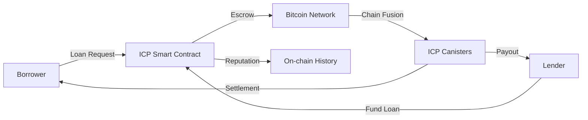
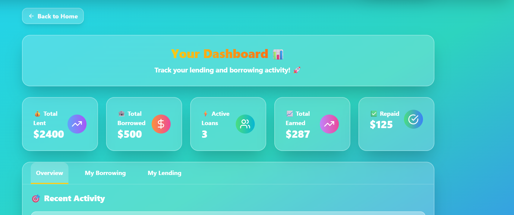
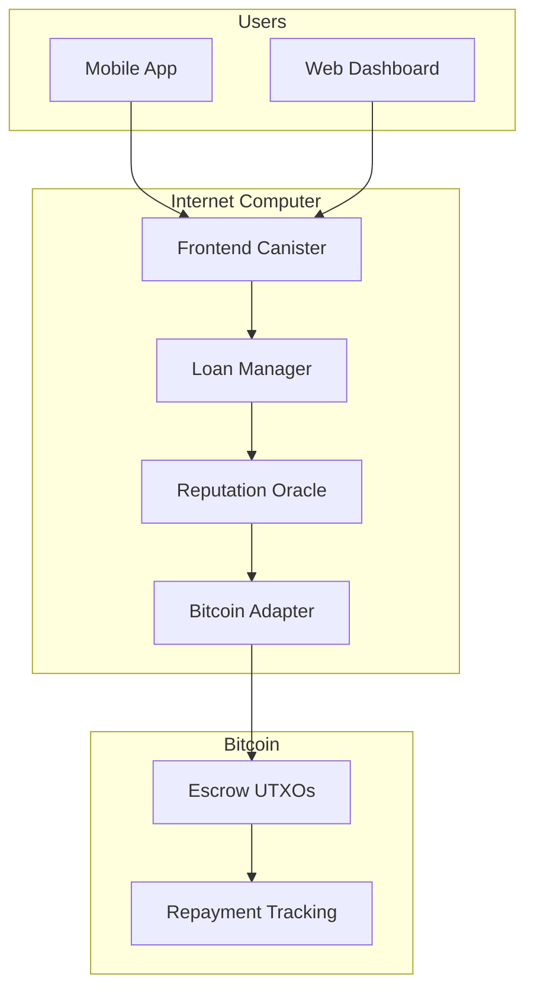
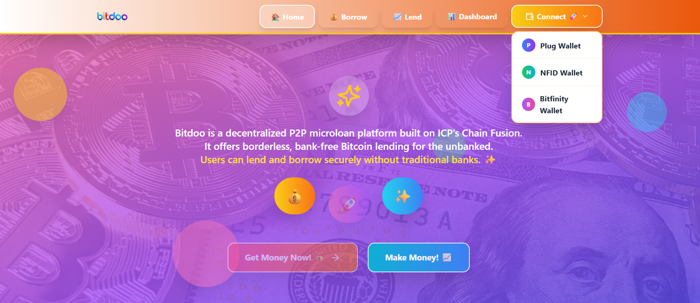

# 🌍 Bitdoo - Decentralized Bitcoin Microloans for the Unbanked powered by ICP's Chain Fusion technology


## 📌 Mission Statement
Democratize credit access by enabling programmable Bitcoin loans through Internet Computer smart contracts - eliminating predatory middlemen in microfinance.



## 🌐 The Global Unbanked Crisis
**1.4 billion people** lack access to basic financial services due to:
- 🏦 Geographic exclusion (rural communities)
- 📉 Exploitative rates (30-200% APR)
- 🕵️♂️ Opacity in traditional microfinance

## ⚡ How Bitdoo Works

### For Borrowers
1. **Request**: Set loan terms (amount/purpose/duration)
2. **Get Funded**: Global lenders compete to fund
3. **Repay**: Automated BTC repayments build on-chain credit


### For Lenders
1. **Browse**: Filter by risk score/category/location
2. **Fund**: Non-custodial ICP escrow
3. **Earn**: Yield from repayments + interest (1-10% APR)




## 🚀 Why Bitdoo is Sustainable

| Factor | Our Advantage |
|--------|---------------|
| **Economic Model** | 1% protocol fee sustains development |
| **Tech Foundation** | ICP's reverse gas model eliminates user fees |
| **Market Fit** | 300% cheaper than avg microfinance rates |
| **Scalability** | Chain Fusion enables native BTC transactions |
| **Regulatory** | Non-custodial design reduces compliance burden |

## 🛠️ Technical Architecture



**Key Components:**
1. **Motoko Smart Contracts**: Loan lifecycle management


2. **Chain Fusion**: Native Bitcoin transaction processing
3. **Reputation System**: On-chain credit scoring
4. **Radix UI**: Accessible frontend components

## 🚀 Installation

To get Bitdoo up and running locally, follow these steps:

### Prerequisites

- ✅ [Node.js](https://nodejs.org/) (v18 or higher recommended)  
- ✅ [DFX SDK](https://internetcomputer.org/docs/current/developer-docs/setup/install/)  
- ✅ [Git](https://git-scm.com/)  
- ✅ A wallet that supports Internet Identity (Plug, NFID, or Bitfinity)

---

### 1. Clone the Repository

```bash
git clone https://github.com/Fatumayattani/bitdoo.git
cd bitdoo
````

---

### 2. Install Dependencies

```bash
npm install
```

---

### 3. Start the Local ICP Replica (for development)

```bash
dfx start --background
```

---

### 4. Deploy Canisters Locally

```bash
dfx deploy
```

---

## ⚙️ Usage

### 1. Run the Frontend in Dev Mode

```bash
npm run dev
```

Then open [http://localhost:3000](http://localhost:3000) in your browser.

---

### 2. Connect Your Wallet

Bitdoo supports:

* [Plug Wallet](https://plugwallet.ooo/)
* [NFID Wallet](https://nfid.one/)
* [Bitfinity Wallet](https://bitfinity.network/)




---

### 3. Lend or Borrow Bitcoin (ckBTC)

* **Lenders** deposit ckBTC and earn interest.
* **Borrowers** request microloans and repay using ckBTC.
* All lending logic is powered by canister smart contracts on the Internet Computer.

---

### 4. (Optional) Withdraw to Real BTC

Users can convert `ckBTC` back to native Bitcoin via the **ckBTC minter** within the app.

---

> 💡 Tip: For mainnet deployment instructions or to request testnet ckBTC, refer to the official Internet Computer documentation or the Bitdoo Wiki (coming soon).

```

## 🔥 Unique Value Proposition

**For Borrowers:**
- 5-minute approvals vs weeks in traditional finance
- 70% lower interest than local loan sharks
- Build credit history via on-chain repayments

**For Lenders:**
- Earn yield on Bitcoin holdings
- Transparent risk assessment
- Default protection via smart contract triggers

## 🛡️ Security Model

| Layer | Protection |
|-------|------------|
| **Smart Contracts** | Formal verification (Motoko) |
| **Bitcoin** | Multi-sig escrow wallets |
| **Reputation** | Sybil-resistant scoring |
| **Frontend** | CSP headers + Auth0 integration |

## 📊 Business Viability

**Revenue Streams:**
- 1% protocol fee on repaid loans
- Premium analytics for institutional lenders
- DAO governance token (future)

**Cost Structure:**
- 90% lower than traditional microfinance ops
- Automated underwriting via smart contracts
- Community-driven risk assessment

## 🧑💻 Tech Stack

**Frontend:**
- React + TypeScript
- Radix UI (accessibility-focused)
- Tailwind CSS
- Wallet integration

**Backend:**
- Internet Computer Protocol
- Motoko smart contracts
- Chain Fusion BTC integration
- Fleek storage for IPFS

## 🌱 Roadmap

**Q3 2025**  
- Mainnet BTC loans launch
- SMS repayment notifications

**Q4 2025**  
- AI risk modeling pilot
- DAO governance prototype

**2026**  
- USSD support for feature phones
- Cross-chain repayment options

## 👥 Team

| Role | Name | Contact |
|------|------|---------|
| Blockchain Developer | Fatuma Yattani | [@fatumayattani](https://twitter.com/fatumayattani) |
| Software Engineer | Samuel Ejalonibu | [@samueleja](https://twitter.com/samueleja) |

